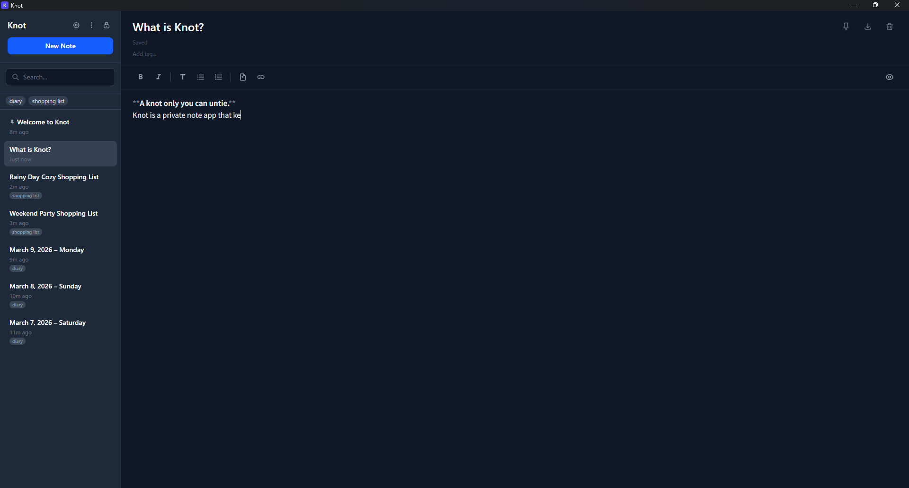
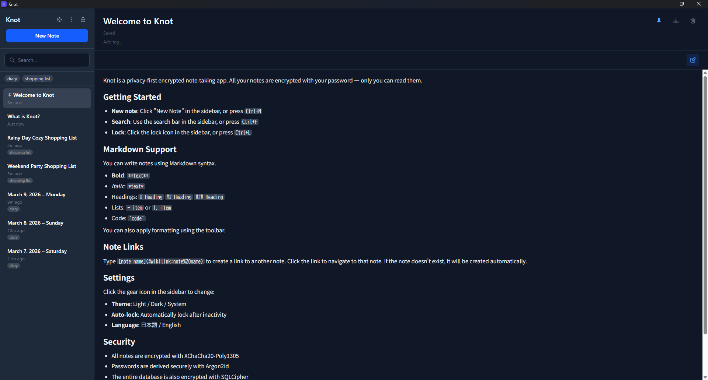
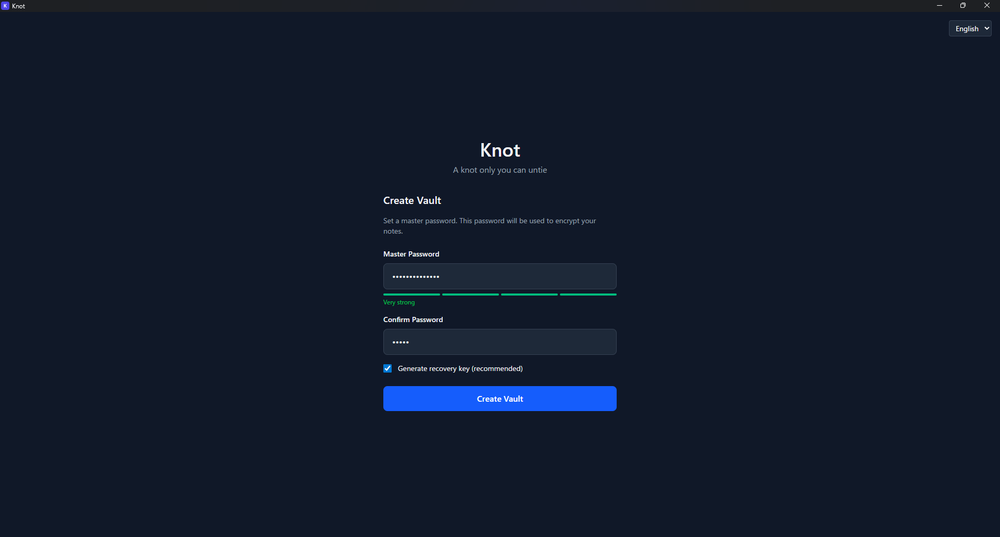
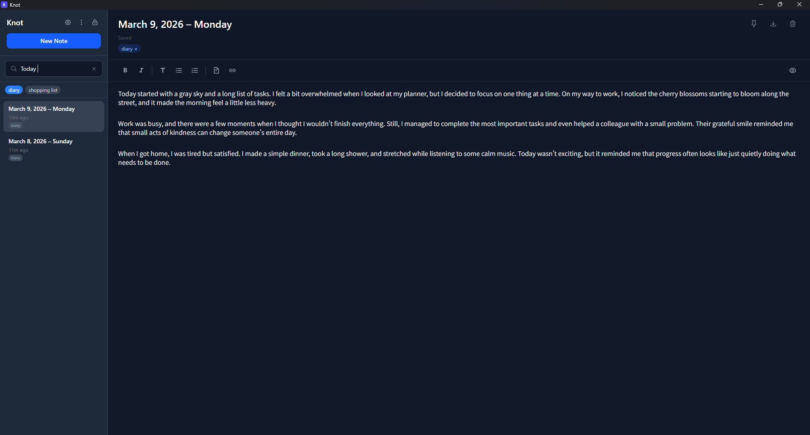

**日本語** | [English](README.md)

# Knot

**あなたにしか解けない結び目。**

Knotは、プライバシーを最優先にした暗号化ノートアプリです。すべてのデータはローカルで暗号化されます。サーバーなし、クラウドなし、平文がディスクに触れることもありません。ゼロ知識アーキテクチャ——あなたのノートを読めるのはあなただけです。

> **ステータス**: アルファ (v0.4.0) — Windowsでテスト済み。macOS/Linuxビルドは動作するはずですが未検証です。



## 機能

- **二重暗号化** — SQLCipherがデータベース全体を暗号化し、XChaCha20-Poly1305がノート内容を個別に暗号化
- **強力な鍵導出** — Argon2id（メモリ64MB、3イテレーション、4並列レーン）
- **リカバリーキー** — BIP39の12単語ニーモニック。PDF出力対応。HKDF-SHA256で導出
- **Markdownエディタ** — CodeMirror 6ベース。シンタックスハイライト、ツールバー、自動保存
- **Markdownプレビュー** — 編集とプレビューをワンクリックで切り替え。GFM対応（テーブル、タスクリスト、打ち消し線）
- **Wikiリンク** — `[[ノート名]]` でノート間リンク。存在しないノートはクリックで自動作成
- **AND検索** — スペース区切りでタイトル・本文・タグを横断検索
- **タグ** — ノートにタグを付けて整理。サイドバーでタグフィルター、オートコンプリート
- **ピン留め** — 重要なノートをリストの先頭に固定
- **インポート/エクスポート** — Markdownファイル（.md）の単体・一括インポート/エクスポート
- **パスワード変更** — データを失わずにボールトのパスワードを変更
- **自動ロック** — 設定可能なアイドルタイムアウト。ロック時にメモリから鍵を消去
- **ブルートフォース保護** — 5回失敗で30秒ロックアウト（再起動後も持続）
- **右クリックメニュー** — ノートリストからピン留め、エクスポート、削除
- **テーマ** — ダーク / ライト / システム（スムーズなトランジション付き）
- **日本語/英語対応**
- **キーボードショートカット** — `Ctrl+N` 新規ノート、`Ctrl+F` 検索、`Ctrl+L` ロック

<details>
<summary>スクリーンショット</summary>

### Markdownプレビュー


### ボールト作成


### 検索・タグ


</details>

## セキュリティ

### アーキテクチャ

```
  パスワード                    リカバリーフレーズ（12単語）
     │                                │
     ▼                                ▼
  Argon2id                      HKDF-SHA256
  (64MB/3/4)                  (ドメイン分離)
     │                                │
     ▼                                ▼
  Master Key                    Recovery KEK
     │                                │
     └──────────────┬─────────────────┘
                    ▼
                   DEK  ← ランダム生成
                    │
              ┌─────┴─────┐
              ▼           ▼
          SQLCipher    XChaCha20-Poly1305
        (DB全体)     (ノート個別)
```

- **ディスク上に平文なし** — ノートの内容もタイトルも暗号化してから保存
- **鍵はメモリ上のみ** — ロック時にDEKをゼロクリアして破棄
- **最小権限** — Tauri APIは `all: false`、`shell.open` のみ許可
- **テレメトリなし、ネットワーク通信なし** — 完全オフライン

### セキュリティに関する注意

> **本ソフトウェアは正式なセキュリティ監査を受けていません。** 暗号化の設計はベストプラクティスに従っていますが（RustCryptoライブラリ、Argon2id、XChaCha20-Poly1305）、第三者による独立したレビューは実施されていません。**現段階では、重要なデータの唯一の保存先としての使用は推奨しません。**

既知のセキュリティ上のトレードオフは [`docs/DESIGN_DECISIONS.md`](docs/DESIGN_DECISIONS.md) に記録しています。特に：
- フロントエンドのパスワードや復号内容はJavaScript/WebViewのメモリモデルの制約上、確実なゼロクリアが困難

### セキュリティレビュー歓迎

コミュニティからのセキュリティレビューを歓迎します。脆弱性や暗号化実装への懸念がある場合：

- **責任ある開示**: 公開Issueの前に [knot.wackiness531@passinbox.com](mailto:knot.wackiness531@passinbox.com) へメールしてください
- **コードレビュー**: 暗号化の実装は [`src-tauri/src/crypto/`](src-tauri/src/crypto/) にあります
- **設計ドキュメント**: [`docs/DESIGN_DECISIONS.md`](docs/DESIGN_DECISIONS.md) と [`docs/SPECIFICATION.md`](docs/SPECIFICATION.md) を参照

## インストール

### ビルド済みバイナリ（推奨）

[リリースページ](https://github.com/pher-lab/knot/releases)から `.exe` または `.msi` インストーラーをダウンロードして実行してください。

### ソースからビルド

**前提条件:**
- [Node.js](https://nodejs.org/) (v18+)
- [Rust](https://rustup.rs/) (最新のstable)
- [Strawberry Perl](https://strawberryperl.com/) (Windowsのみ — SQLCipherビルドに必要。MSYS2のPerlでは不可)
  - `C:\Strawberry\perl\bin` がPATH内でMSYS2より前にあること

```bash
# 依存関係のインストール
npm install

# 開発
npm run tauri:dev

# インストーラーのビルド
npm run tauri:build
```

ビルドされたインストーラーは `src-tauri/target/release/bundle/` にあります。

## 使い方

1. **ボールトを作成** — マスターパスワード（8文字以上）を設定。オプションでリカバリーキーを生成し、PDFを安全な場所に保管。
2. **ノートを書く** — Markdown記法が使えます。ツールバーで簡単にフォーマット。入力中に自動保存。
3. **プレビュー** — ツールバーの目のアイコンをクリックして、編集とプレビューを切り替え。
4. **ノートをリンク** — `[[ノート名]]` と入力してノート間にリンクを作成。
5. **整理** — タグを付けて分類、ピン留めで固定、サイドバーでタグフィルター。
6. **検索** — サイドバーの検索バーか `Ctrl+F` で検索。スペースでAND検索。
7. **ロック** — ロックアイコンか `Ctrl+L` でロック。暗号化キーがメモリから消去されます。
8. **リカバリー** — パスワードを忘れた場合、12単語のリカバリーフレーズで新しいパスワードを設定。

## 既知の制限事項（アルファ版）

- **Windowsのみテスト済み** — macOSとLinuxビルドは動作するはずですが未検証
- **同期なし** — 現時点では完全ローカル
- **自動アップデートなし** — 新バージョンは手動更新が必要

## 技術スタック

| レイヤー | 技術 |
|---------|------|
| フロントエンド | React 19, TypeScript, Vite 7, Tailwind CSS 4, Zustand, CodeMirror 6 |
| バックエンド | Rust, Tauri 1.8, SQLCipher, RustCrypto (chacha20poly1305, argon2, hkdf, bip39) |
| テスト | 131テスト（Rust 100 + フロントエンド 31） |

## 開発

```bash
npm run tauri:dev      # 開発サーバー起動（フロントエンド + バックエンド）
npm run tauri:build    # プロダクションビルド

# テスト実行
cd src-tauri && cargo test    # Rustテスト (100)
npm run test:run              # フロントエンドテスト (31)
```

## フィードバック・連絡先

フィードバックをお待ちしています。

- **バグ報告・機能要望**: [GitHub Issues](https://github.com/pher-lab/knot/issues)
- **セキュリティ脆弱性**: [knot.wackiness531@passinbox.com](mailto:knot.wackiness531@passinbox.com)（責任ある開示をお願いします）
- **一般的なお問い合わせ**: [knot.wackiness531@passinbox.com](mailto:knot.wackiness531@passinbox.com)
- **メンテナー**: [@pher-lab](https://github.com/pher-lab)

## 謝辞

### AI支援開発

このプロジェクトは [Claude Code](https://claude.ai/code)（Anthropic）を活用して開発されました。透明性はこのプロジェクトの核となる価値観です。

- **AIが生成**: コード、テスト、ドキュメントの大部分はClaude Codeが記述
- **人間が指揮**: アーキテクチャ、機能の優先順位、セキュリティのトレードオフ判断はすべて開発者が決定
- **人間がレビュー**: すべてのコード変更は開発者がレビュー・承認してから統合
- **AIセキュリティレビュー**: AIによるセキュリティレビューを実施（結果は [`docs/HANDOFF.md`](docs/HANDOFF.md) を参照）——正式な監査の代替では**ありません**

## ライセンス

[AGPL-3.0](https://www.gnu.org/licenses/agpl-3.0.html) — プライバシーツールは透明であるべきだから。
