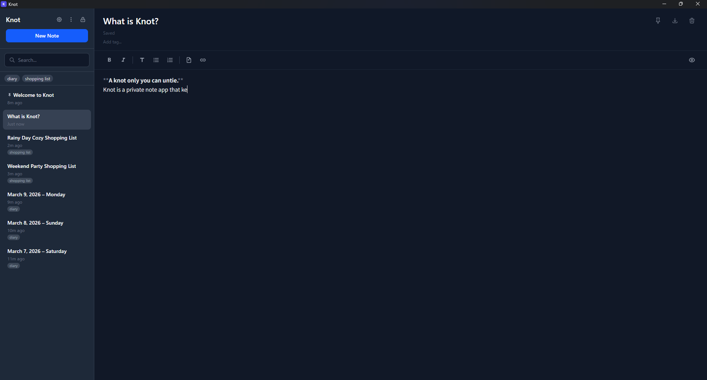
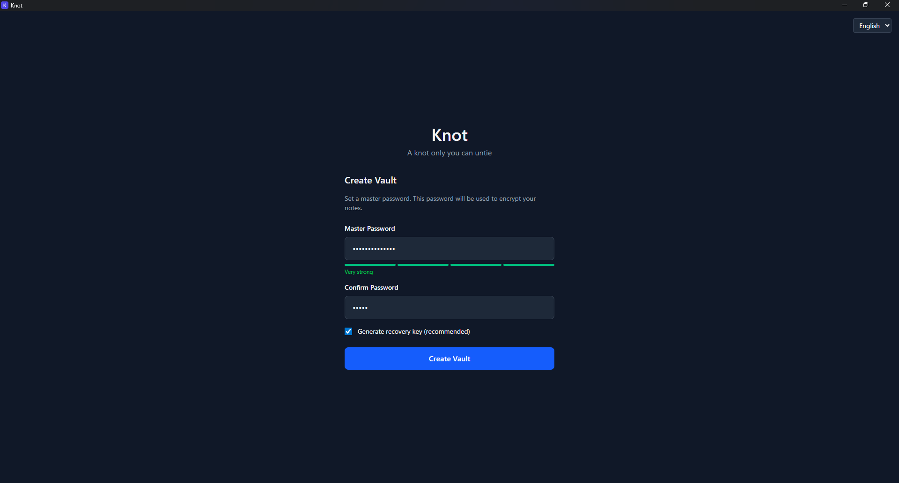
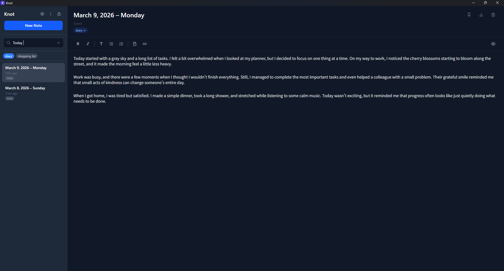

# Knot

**A knot only you can untie.**

Knot is a privacy-first encrypted note-taking app. All your data is encrypted locally — no server, no cloud, no plaintext ever touches disk. Built with a zero-knowledge architecture: only you can read your notes.

> **Status**: Closed Alpha (v0.1.0) — Windows tested, macOS/Linux builds should work but are untested.



## Features

- **Dual-layer encryption** — SQLCipher encrypts the entire database; XChaCha20-Poly1305 encrypts each note's content on top
- **Strong key derivation** — Argon2id (64MB memory, 3 iterations, 4 parallel lanes)
- **Recovery key** — BIP39 12-word mnemonic with PDF export, derived via HKDF-SHA256
- **Markdown editor** — CodeMirror 6 with syntax highlighting, toolbar, and auto-save
- **Wiki links** — `[[note name]]` to link between notes; missing notes are auto-created on click
- **Full-text search** — Encrypted search across all notes
- **Auto-lock** — Configurable idle timeout with immediate memory cleanup
- **Brute-force protection** — 5 failed attempts triggers a 30-second lockout
- **Theme** — Dark / Light / System
- **Bilingual** — English and Japanese (日本語)
- **Keyboard shortcuts** — `Ctrl+N` new note, `Ctrl+F` search, `Ctrl+L` lock

<details>
<summary>More screenshots</summary>

### Vault Setup


### Search


</details>

## Security

### Architecture

```
  Password                    Recovery Phrase (12 words)
     │                                │
     ▼                                ▼
  Argon2id                      HKDF-SHA256
  (64MB/3/4)                  (domain separation)
     │                                │
     ▼                                ▼
  Master Key                    Recovery KEK
     │                                │
     └──────────────┬─────────────────┘
                    ▼
                   DEK  ← randomly generated
                    │
              ┌─────┴─────┐
              ▼           ▼
          SQLCipher    XChaCha20-Poly1305
        (full DB)     (per-note content)
```

- **No plaintext on disk** — All note content and titles are encrypted before storage
- **Keys only in memory** — DEK is zeroed and dropped on lock
- **Minimal permissions** — Tauri API allowlist is `all: false`, only `shell.open` is permitted
- **No telemetry, no network** — Fully offline, no outbound connections

### Security Notice

> **This software has not undergone a formal security audit.** While the cryptographic design follows established best practices (RustCrypto libraries, Argon2id, XChaCha20-Poly1305), no independent review has been performed. **Do not use Knot as your sole storage for critical or irreplaceable information at this stage.**

Known security trade-offs are documented in [`docs/DESIGN_DECISIONS.md`](docs/DESIGN_DECISIONS.md). In particular:
- Passwords and decrypted content in the frontend are subject to JavaScript/WebView memory model limitations and cannot be reliably zeroed
- Brute-force lockout state is in-memory only (resets on app restart)

### Security Review Welcome

We actively welcome security review from the community. If you find a vulnerability or have concerns about the cryptographic implementation:

- **Responsible disclosure**: Please email [knot.wackiness531@passinbox.com](mailto:knot.wackiness531@passinbox.com) before opening a public issue
- **Code review**: The full cryptographic implementation is in [`src-tauri/src/crypto/`](src-tauri/src/crypto/)
- **Design docs**: See [`docs/DESIGN_DECISIONS.md`](docs/DESIGN_DECISIONS.md) and [`docs/SPECIFICATION.md`](docs/SPECIFICATION.md)

## Install

### From Pre-built Binary (Recommended)

Download the latest `.msi` installer from the release and run it.

### Build from Source

**Prerequisites:**
- [Node.js](https://nodejs.org/) (v18+)
- [Rust](https://rustup.rs/) (latest stable)
- [Strawberry Perl](https://strawberryperl.com/) (Windows only — required for SQLCipher build, MSYS2 Perl won't work)
  - Ensure `C:\Strawberry\perl\bin` is in PATH before any MSYS2 paths

```bash
# Install dependencies
npm install

# Development
npm run tauri:dev

# Build installer
npm run tauri:build
```

The built installer will be in `src-tauri/target/release/bundle/`.

## Usage

1. **Create a vault** — Set a master password (8+ characters). Optionally generate a recovery key and save the PDF somewhere safe.
2. **Write notes** — Use Markdown syntax. The toolbar provides quick formatting. Notes auto-save as you type.
3. **Link notes** — Type `[[note name]]` to create links between notes.
4. **Search** — Use the search bar in the sidebar or press `Ctrl+F`.
5. **Lock** — Click the lock icon or press `Ctrl+L`. Your encryption keys are wiped from memory.
6. **Recover** — If you forget your password, use your 12-word recovery phrase to set a new one.

## Known Limitations (Alpha)

- **Windows only (tested)** — macOS and Linux builds are expected to work but haven't been tested yet
- **Performance** — Note list decrypts all notes on load; may slow down with hundreds of notes
- **No sync** — Fully local for now. Encrypted sync is planned for a future phase
- **No import/export** — Coming in a future release
- **No auto-update** — Manual update required for new versions

## Roadmap

| Phase | Description | Status |
|-------|-------------|--------|
| **1. MVP** | Local encrypted notes, Markdown editor, recovery key, i18n | **Current** (Closed Alpha) |
| **2. Sync** | E2E encrypted sync, P2P (libp2p), CRDT conflict resolution, import/export | Planned |
| **3. Hardening** | Tor integration, metadata encryption, plausible deniability | Future |
| **4. Expansion** | Mobile (Tauri 2.0), hardware key (YubiKey), post-quantum crypto | Future |

See [`docs/SPECIFICATION.md`](docs/SPECIFICATION.md) for details.

## Tech Stack

| Layer | Technology |
|-------|-----------|
| Frontend | React 19, TypeScript, Vite 7, Tailwind CSS 4, Zustand, CodeMirror 6 |
| Backend | Rust, Tauri 1.8, SQLCipher, RustCrypto (chacha20poly1305, argon2, hkdf, bip39) |
| Tests | 94 tests (Rust 63 + Frontend 31) |

## Development

```bash
npm run tauri:dev      # Start dev server (frontend + backend)
npm run tauri:build    # Production build

# Run tests
cd src-tauri && cargo test    # Rust tests (63)
npm run test:run              # Frontend tests (31)
```

## Feedback & Contact

This is a closed alpha — your feedback is invaluable.

- **Bug reports & feature requests**: [GitHub Issues](https://github.com/pher-lab/knot/issues)
- **Security vulnerabilities**: [knot.wackiness531@passinbox.com](mailto:knot.wackiness531@passinbox.com) (please use responsible disclosure)
- **General inquiries**: [knot.wackiness531@passinbox.com](mailto:knot.wackiness531@passinbox.com)
- **Maintainer**: [@pher-lab](https://github.com/pher-lab)

## Acknowledgments

### AI-Assisted Development

This project was developed with significant AI assistance using [Claude Code](https://claude.ai/code) (Anthropic). Transparency is a core value of this project, so here's what that means concretely:

- **AI-generated**: The majority of code, tests, and documentation were written by Claude Code
- **Human-directed**: All architectural decisions, feature priorities, and security trade-off judgments were made by the developer
- **Human-reviewed**: All code changes were reviewed and approved by the developer before integration
- **AI security review**: An AI-assisted security review was conducted (see [`docs/HANDOFF.md`](docs/HANDOFF.md) for findings) — this is **not** a substitute for a formal audit

## License

[AGPL-3.0](https://www.gnu.org/licenses/agpl-3.0.html) — Because privacy tools should be transparent.
